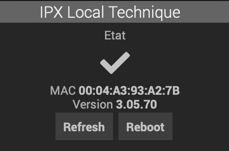

# Plugin CGE IPX V3 pour Jeedom V4 

plugin-jeeipxv3 is a Jeedom V4 plugin for the CGE IPX 800 V3 card.

Requires IPX800 V3 to run firmware > 3.05.46 ( ioname.xml must be supported )
    
- supports as many IPX card as you want as individual jeedom equipments with configuPush and Reboot action
- support Analog, Output Relay,  Digital Inputs ( analog, led and btn entries in IPX ) and Counters
- presents the IPX card output relays and digital inputs as individual Jeedom equipement usable in scenario and dashboards
- gets the equipment names by default from the IPX configuration for Jeedom equipement ( but can be changed afterward )
- configurable regular polled refresh for all data with a ConfigPush action  ( shortens the API Key to 32 chars to fit IPX )  
- but also support configuration a Push url on IPX to get real time updates into Jeedom 
- calculates and display the proper corrected analog value for analog entries based on the IPX chosen configuration ( PH, Temp, ... )

## Utilisation

- a root IPX equipment must first be created with the IP address, and eventually the port number, the user name , password to reach the IPX. 

- the Equipment configuration dialog enables to select what IPX relays, digital input, analog input to create in Jeedom by ticking the checkboxes. By default the names used in the IPX800 card will be used as names for the jeedom equipment but this can be changed in Jeedom after the initial creation phase.

:warning: unticking a checkbox will trigger the **removal** of the corresponding equipment so be careful before saving

- Once proper IP, and optional user & pwd are entered and successfully saved: 2 actions button can be used in the Equipment configuration screen
 - the "configpush" button can be used to send the Push URL configuration to the IPX card so that jeedom is updated in near real time from the IPX.  That configpush can also be triggered via an action command on the IPX equipment and can be called later or by a scenario.

 - similarly a "Test Access" button is there to test the reachability of the IPX card from the Jeedom box. 

- IPX supports different types of analog inputs which changes the calculation of the raw input values. The types of analog inputs are coming directly from the IPX800 configuration and is displayed in the jeedom dialog. To change it, type you need to change it in the IPX800 configuration. it will change accordingly in jeedom at the next refresh and the proper calculation formula to display the sensor value will be automatically used in Jeedom

- Child equipements are created based on the user selection, and displayed with different icons! 
[Child Equipments](../images/child%20equipments.png)

- On the dashboard view, equipements can be displayed with your favorite widgets and all equipement commands are useable in scenarii

## Commandes

IPX800 root equipment
- **Etat** (info) : 1 if the IPX800 is reachable
- **MAC** (info) : MAC addres of the IPX800
- **Version** (info) : the IPX firmware information
- **UpdateTime** (info) : last timestamp of successful communication
- **Rafraichir** (action) : forces a data refresh, otherwise information is refreshed either by the recurrent loop every x seconds as configured in the plugin configuration dialog,  or on any changes if the PUSH url has been configured on the IPX
- **configPush** : configure the IPX800 with the push URL that points to the plugin event(). it will update directly the equipements
- **reboot** (action) : reboots the IPX800
- **Last XML** : a json encoded version of the last status information received from the IPX

IPX800 Relay ( led ) equipment
- **Etat** (info) : O or 1 if relay is respectively open or close
- **On** (action) : will trigger a close action on the relay. if the relay is configured in impulse mode on the IPX (Ta Tb values are not zero) it triggers the impulse and does not stay in close position, according to the Tb IPX settings
- **Off** (action) : will open the relay and force to go in OFF state
- **Commute** (action) : will toggle the state of the relay ( ON=>OFF or OFF=>ON )
- **Impulse** (action) : will force a impulse ( ON then OFF ) on the relay 

The default generic type for the on off command is LIGHT ON  , LIGHT OFF but that can be changed by the user

IPX800 Digital Input ( btn ) equipment
- **Etat** (info) : O or 1 if input digital is respectively off or on
- **On** (action) : forces the input to be on 
- **Off** (action)  : forces the input to be off 
- **Commute** (action) : will toggle the state of the input ( ON=>OFF or OFF=>ON )

The default generic type for the on off command is LIGHT ON  , LIGHT OFF but that can be changed by the user

IPX800 Analog Input ( btn ) equipment
- **Etat** (info - Numeric) : the analog value received from the IPX, corrected by the correct calculation that depends on the IPX analog sensor type selected in the IPX configuration 

The default generic type for the on off command is TEMPERATURE but that can be changed by the user

IPX800 Counter ( count ) equipment
- **Count** (info - Numeric) : the value of the counter
- **Reset** (action) : will reset counter to 0
- **Set** (action) : will set counter to a specified value ( slider )

## Change Log

[Change Log](changelog.md)

## Installation

after installation, the device appear on your dashboard this way

