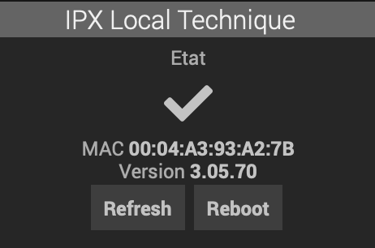

# Plugin Jeedom V4 pour la carte IPX V3 DE CGE

plugin-jeeipxv3 is a Jeedom V4 plugin for CGE IPX 800 V3 card.

Requires IPX800 V3 to run firmware > 3.05.46 ( ioname.xml must be supported )
    
- supports as many IPX card as you want as individual jeedom equipments with configuPush and Reboot action
- support Analog, Output Relay, and Digital Inputs ( analog, led and btn entries in IPX )
- presents the IPX card output relays and digital inputs as individual Jeedom equipement usable in scenario and dashboards
- gets the equipment names by default from the IPX configuration for Jeedom equipement ( but can be changed afterward )
- configurable regular polled refresh for all data with a ConfigPush action  ( shortens the API Key to 32 chars to fit IPX )  
- but also support configuration a Push url on IPX to get real time updates into Jeedom 
- calculates and display the proper corrected analog value for analog entries based on the IPX chosen configuration ( PH, Temp, ... )

## Utilisation

- a root IPX equipment must first be created with the IP address, and eventually the port number, the user name , password to reach the IPX. 

- the Equipment configuration dialog enables to select what IPX relays, digital input, analog input to create in Jeedom by ticking the checkboxes. :warning: unticking a checkbox will trigger the removal of the corresponding equipment so be careful before saving

- the type of analog input is coming from the IPX800 configuration and is displayed in the jeedom dialog. to change that type you need to change it in the IPX800 configuration. it will change accordingly in jeedom at the next refresh and the proper calculation formula to display the sensor value will be automatically used in Jeedom

## Commandes

IPX800 root equipment
- **MAC** (info) : MAC addres of the IPX800
- **Version** (info) : the IPX firmware information
- **UpdateTime** (info) : last timestamp of successful communication
- **refresh** (action) : forces a data refresh, otherwise information is refreshed either by the recurrent loop every x seconds as configured in the plugin configuration dialog,  or on any changes if the PUSH url has been configured on the IPX
- **configPush** : configure the IPX800 with the push URL that points to the plugin event(). it will update directly the equipements
- **reboot** (action) : reboots the IPX800

IPX800 Relay ( led ) equipment
- **Etat** (info) : O or 1 if relay is respectively open or close
- **On** (action) : will trigger a close action on the relay. if the relay is configured in impulse mode on the IPX it triggers the impulse and does not stay close according to the Tb IPX settings
- **Off** (action) : will open the relay and force to go in OFF state

IPX800 Digital Input ( btn ) equipment
- **Etat** (info)
- **On** (action)
- **Off** (action)

IPX800 Analog Input ( btn ) equipment
- **Etat** (info)

## Change Log

[Change Log](changelog.md)

## Installation

after installation, the device appear on your dashboard this way

